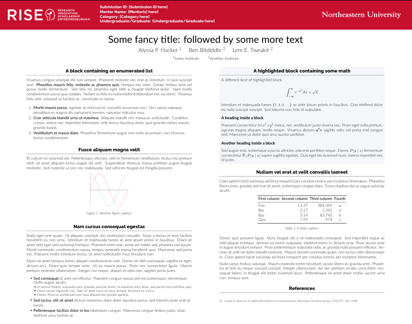

A LaTeX poster template for Northeastern's Research and Creative Endeavor, Innovation, Scholarship and Entrepreneurship Expo (RISE). The only template Northeastern provides is in powerpoint lol. Based on the [gemini](https://github.com/anishathalye/gemini) poster template.

# Use
If you want to edit this on your own machine, use the `xelatex` compiler, which can be installed with the `texlive-xetex` package. Alternatively, you can import this directly into overleaf.

